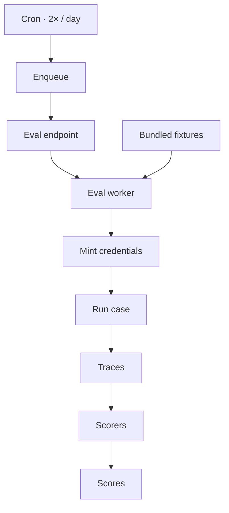

[Part 2](/blog/posts/building-an-ai-product-in-finance-2-agent-loop/) was the loop. This post is the thing that watches it.

The daily eval is how we stopped flying blind. An engineer could land a change of goodwill and quietly hurt the assistant. Now we know which day, and which commits, improved the harness or wounded it.

---

Story — flying blind
--------------------

A loop without a morning number is a vibe. Someone ships a prompt tweak. Someone adds a tool. Staging looks fine. A week later a support question about a tax lot answers like a brochure.

We wanted a process, not a feeling. Domain and case fixtures as YAML in the repo. Composable scorers — code or agent. A CLI for the change you are about to land. A dashboard for the aggregate and the one bad case.

We quickly tried the usual answers:

- **Only vibe-check in staging.** Fast. Unrepeatable. The next person cannot rerun your chat.
- **Only production traces.** You find the fire after the customer already felt it. And you still cannot store the chat if it has PI / PII.
- **Only a vendor eval suite.** Demos well. Then you need a finance-shaped case, a frozen clock, and a firm account, and you are forking their product.
- **Only `assert "tax lot" in answer`.** You test the words. You miss the tool that should have been called, the sentence compliance will not allow, the table that never showed up.

We kept the cases in git, and we made the runner a job.

---

Case fixtures
-------------

We cannot store PI / PII anywhere. We learned the *patterns* from production traffic — how we turn those patterns into synthetic fixtures is the next post. This one is the gym those fixtures run in.

The taxonomy came first. About **30 domains**. About **400 cases**. Trading, portfolio, research, support, guardrails, the boring navigation questions. Engineers contribute cases. Engineers contribute scorers. The runner does not care who wrote the YAML.


A case is a small object on purpose:

```yaml
case:
  id: xxx
  history: <reference_to_history_fixture>
  query: ...
  timestamp: ...
  scorers:
    - name: compliance
      what_not_say: |
        ...
    - name: fact_grounding
      ground_on_help_center: true
      ground_on_corporate_actions: true
      ground_on_tools: true
    - name: response_structure
      requirements: |
        Must have a preamble, then a short description, then a table.
    - name: tools
      expect_tools: [a, b, c]
      unexpected_tools: [x, y, z]
```

The scorers compose. Compliance is "do not say this." Fact grounding is "stand on the help center, the corporate action, the tool result." Response structure is "preamble, then the table." Tools is a allow-list and a deny-list. You mix them per case. You do not write a new judge for every ticker.

People say LLM-as-judge. What we actually run is **agent-as-judge**. The grader is an agent. It gets tools — web search included. A code scorer can check the tool tape. An agent scorer can go look something up. It is not perfect. We are still improving it. It is still better than a human rereading four hundred chats every morning.

That schema is also how I designed the rest of the pipe: an **internal eval endpoint** with restricted permission, an **eval worker** that runs as the user the case is supposed to be, and a **cron** that kicks the job.

---

Firm accounts, and a frozen clock
---------------------------------

A YAML query is not enough in brokerage-land. The assistant is looking at *someone's* account.

So we keep **firm accounts**. They are real accounts in the system. The identity that would be PI — SSN and friends — is mocked. They hold a small amount of real money. That is how you simulate the things a string fixture will not: fund deficiency, a long recurring-investment history, a long list of holdings and tax lots.

The other thing a string fixture will not do is sit still.

In finance you simulate a scene, and then the market moves, or the user's buying power moves, or "today" is no longer the day in the YAML. I realized we had to model three things, not one:

1. Market data
2. User-scoped data
3. Time

So the case schema got a **frozen-time** latch. The timestamp on the case is not decoration. It pins the quotes, the lots, and the clock.


Without that latch, a case that passed on Tuesday fails on Wednesday because a quote moved, and you spend the morning debugging the universe instead of the harness.

---

End to end
----------

The morning job is not a notebook. It is a pipe.



Twice a day, every day. Cron enqueues. The internal endpoint is the only door, and it is picky about who knocks. The worker reads the fixtures out of the bundled image, mints credentials for the firm accounts, runs each case, writes the trace, then runs the scorers.

The CLI is the same pipe, pointed at the change you have not landed yet. If you are about to touch a skill, you run the cases that skill owns. You do not wait for tomorrow morning to learn you broke funding-deficiency.

The dashboard is just two views of the same scores: the aggregate, and the one bad case. I can see which scorer complained — compliance, tools, structure, grounding — without rereading a transcript. I am not going to paste the screens. The point is the mechanism: a morning signal, at case level, tied to a commit.

---

#### Good

- Goodwill changes stop being invisible. You know the day and the commit.
- Cases and scorers live in the repo. An engineer can add a domain without asking the runner for a new feature.
- Agent-as-judge plus code scorers cover "did it call the tool" and "is this even allowed to say that."
- Frozen time keeps a finance case still. You debug the harness, not the tape.
- The CLI and the cron are the same job. Local is not a different product.

#### Drawback

- Four hundred cases is a garden. If nobody weeds it, you are measuring a museum.
- Agent-as-judge is still a judge with opinions. Web search helps. It also hallucinates with better citations. You have to watch the watchers.
- Firm accounts with real money are operational load. Someone has to keep them funded and not-quite-real.
- Frozen time is a lie you must keep consistent across market data, user data, and the clock. Drift one of them and the case is fiction.
- A twice-a-day job can become the only time anyone looks. The CLI only helps if people run it.

---

Next
----

The gym is only as honest as the fixtures you are willing to put in git.

How we write those fixtures without storing PI / PII — personas, scenarios, production sampling that proposes a PR — is the next post.
