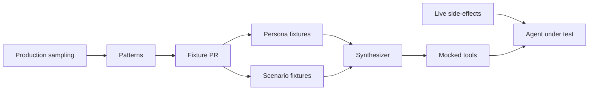

[Part 3](/blog/posts/building-an-ai-product-in-finance-3-daily-eval/) was the gym. This post is how we fill it without storing a customer.

The daily eval is honest. It is also slow if the only way to run it is to land the change and wait for morning. I wanted the same cases on my laptop. I also wanted zero PI / PII in git.

---

Story — waiting for morning
---------------------------

The assistant does not live in a prompt. It lives on a pile of upstream services: transfers, lots, activity, help-center, in-app navigation. A YAML query without those dependencies is a brochure.

So the first local loop I actually had was: push, wait, read the morning job, push again. That is not a development loop. That is a weather report.

I kept asking the same question. How do I run the agent against my local change, and still resolve every dependency the system has — without a real customer record sitting on disk?

We quickly tried the usual answers:

- **Wait for the morning job.** Honest. Two days later you learn you broke a funding-deficiency case.
- **Point local at staging.** Then you are testing their data, their clock, their outage. And staging still has people in it.
- **Record and replay a real customer.** You just stored PI / PII. The fixture is now a liability.
- **Hand-write a JSON mock for every tool.** You will not keep four hundred of those up to date. You will test the mock you felt like writing.

The cut that unlocked the rest: the agent never sees those upstream services. The agent sees **MCPs** and **tools**. Mock those, and the rest of the universe can stay home.

Bazel packs the runnable image. Local is the same binary as the job. The only thing that changes is who answers the tool call.

---

The synthesizer
---------------

I did not want a pile of recorded payloads. I wanted an agent whose job is to *invent* a tool result that fits a fixture.

The synthesizer takes a small, deliberate context:

- **Persona** — identity, feature flags, accounts, holdings
- **Scenario** — today's story, plus the facts that must be true
- **Tool input args** — what the assistant just asked for
- **Tool output shape** — the schema the harness already knows
- **Web search** — help-center and domain knowledge the synthesizer is allowed to look up
- **In-app navigation** — mocked, so a deep link still has somewhere to point

That is the whole window. Goal at the top. Persona and scenario in the sys-prompt. Tools the synthesizer itself may call. Then the user turn is just a tool name and a JSON args blob.


The assistant under test still thinks it called `transfers`. What answered is another agent, holding a synthetic person and a plot twist.

---

Offline, on the laptop
----------------------

Here is a local run. Watch the tape.

`transfers`, `ach_transfer_history`, and `accountActivity` do not hit a backend. Each one opens `eval_tool_synthesizer`, gets a response, and continues. Side-effects that are safe to keep live — `case_intent`, `self_serve_flow` — still run. The agent can route a case. It cannot see a real deposit.


No customer record was loaded to make that picture. The persona is a file. The scenario is a file. The case that asked the question is a file. Production traffic taught us the *pattern*. Git holds the fiction.

A separate process can sample production, learn those patterns, and open a PR that updates a persona or a scenario. The sampler never writes a row of PI / PII into the repo. The PR is the only door.



---

Persona and scenario
--------------------

Two building blocks. I keep them apart on purpose.

A **persona** is who the customer is. Conservative parent. Student. Professional newbie. Professional veteran. YOLO. Savings, credit, risk appetite. The accounts they hold. The features that are on.

A **scenario** is what is going on *today*. Buying power held by options. Position closing only. A worthless security. A pending ACH. An unexpected post-trade debit. A failed withdrawal.

The persona can show up in many plots. The plot can happen to many personas. If you glue them into one "David had a bad ACH" fixture, you cannot reuse either half.

```
eval/fixtures/
├── cases/
│   └── ...
├── personas/
│   ├── conservative_parent.yaml
│   ├── student.yaml
│   ├── professional_newbie.yaml
│   ├── professional_veteran.yaml
│   └── yolo.yaml
└── scenarios/
    ├── bank_debit_not_posted.yaml
    ├── buying_power_held_by_options.yaml
    ├── deposit_routing_mismatch.yaml
    └── credit_card_declined.yaml
```

`cases/` is the gym from [Part 3](/blog/posts/building-an-ai-product-in-finance-3-daily-eval/). `personas/` and `scenarios/` are what the synthesizer reads when a case needs a world. An engineer lands any of them the same way: a PR.

A persona is a profile, not a person. This one is invented.

```yaml
name: conservative_parent
timezone: America/New_York
identity:
  full_name: David Hale
  email: david.hale@example.com
  account_number: "123456789"
  state: CA
features:
  gold:
    status: active
  crypto:
    status: active
  options:
    status: level_2
  margin:
    status: disabled
accounts:
  - account_number: "i09x56789"
    account_type: brokerage_individual
    nick_name: My Life
    is_default: true
    cash: 10000.0
    holdings:
      - ticker: AAPL
        instrument_id: 450dfc6d-5510-4d40-abfb-f633b7d9be33
        quantity: 15.0
        average_buy_price: 165.0
        current_price: 205.0
```

A scenario is a story plus the facts the synthesizer is not allowed to contradict. The clock is a latch, same idea as frozen time in the gym.

```yaml
name: bank_debit_not_posted
clock: "2026-07-08T16:00:00-07:00"
story: >
  On July 3, 2026 the user's bank showed one ACH debit. The system has
  exactly one matching deposit attempt; it failed and reversed, so no
  funds posted. There are no other bank debits.
facts:
  transfers:
    - kind: ach_deposit
      status: failed
      initiated: "2026-07-03"
      account: default
      status_description: authorization reversed
      bank_account_nickname: Checking
```

David Hale does not exist. The ACH did not happen. The pattern — bank shows a debit, the app never posted it — is what we learned from production. That is the only thing we were allowed to keep.

---

How much you invent
-------------------

There is a trick, and I still get it wrong.

You can control the identity, the facts, the tool shape, the clock. You can let the synthesizer invent the JSON wording, an extra plausible row, the help-center flavor, the navigation copy.


Too much control and you wrote the mock by hand. You are back to a JSON file nobody updates.

Too much synthesize and Tuesday's case is not Wednesday's case. The scorer starts grading the synthesizer's mood.

The facts in the scenario are the latch. The wording is the slack. If a fact is in the YAML, the tool result has to honor it. Everything else can sound like a person.

---

#### Good

- Local is the same agent. You mock what it actually calls, not a second product.
- Persona and scenario compose. One parent, many plot twists. One plot twist, many parents.
- Production teaches patterns. Git holds fiction. No PI / PII in the repo.
- The synthesizer has a schema to fill, not a blank page. Shape in, payload out.
- Side-effects can stay live. You still test the route. You do not test a real transfer.
- A fixture PR is how the garden grows. The sampler proposes. An engineer lands it.

#### Drawback

- A synthesizer is another agent with opinions. It will invent a helpful row that the facts did not ask for. You have to fail those.
- The control / synthesize cut is a taste. Drift it and the case is either a script or a coin flip.
- Personas rot. Features change. A "gold: active" from last quarter is a different product.
- Live side-effects on a laptop still have a blast radius. Keep that list short on purpose.
- Pattern-from-prod only works if someone reads the sampler's PR. A quiet garden is how PI sneaks back in as "just one real example."

---

Next
----

That is the four-post map I set out to write. Transport. Loop. Gym. Sandbox.

The thing I would write next, if this series grows a fifth, is the sampler itself — how a production pattern becomes a fixture PR without a customer ever landing in git.
