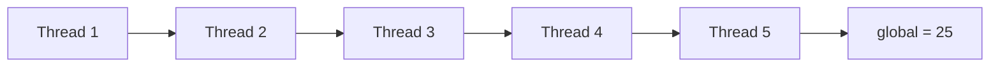

I recently am asked with this pseduo code for concurrent programming problem:

Given the following code, tell me what is the possible range of value for `global`?

```
int global = 0;void t() {  for (int i = 0; i < 5; i++)    global++;}main() {  for (int i = 0; i < 5; i++)    thread_run(t);}
```

The answer is **from 2 to 25**!

### Explained

To solve this problem, you have to be aware of **that** `global` **is NOT an atomic variable nor protected by any lock**.

From there, the `++global` are basically three atomic operation in sequence:

-   Read value from memory to CPU register
-   Increment value of the CPU register
-   Write CPU register to memory

So the inconsistency could happen in between READ and WRITE.

### Upper bound explained

The most happy result would be that the 5 threads execute in sequence, illustrated in the diagram below:




You could shuffle the order of threads and the result would be the same.

### Lower bound explained

What if threads race against each other?

To answer that, let’s start with simpler problem: Two threads and no loop.

```
int global = 0;void t() {  global++;}main() {  for (int i = 0; i < 2; i++)    thread_run(t);}
```

As illustrated below, you see that `global` could end up `1` because one thread reads the old value for increment operation.


Then we slightly add more complexity in order to approach the problem closer to the original one: keep two threads but have two `global++` in each thread.

```
int global = 0;void t() {  for (int i = 0; i < 2; i++)    global++;}main() {  for (int i = 0; i < 5; i++)    thread_run(t);}
```

Again as illustrated below, thread #1 ’s last increment happens to override the other thread’s whatever operation to `global`.


Actually, N times of `global++` and two `global++` result the same! **It is because this thread’s last increment could read the very old value,** `1`**, and write** `2` **as the last operation among the threads.**


Even you increase threads from two to five, or even larger number. The race condition could end up with the same result, which gives us the lower bond of the possible value of `global` as always 2.

---

I hope this would help you in your software engineering career. Please don’t hesitate to leave likes and that will encourage me to continue writing more interesting insights along the course.
